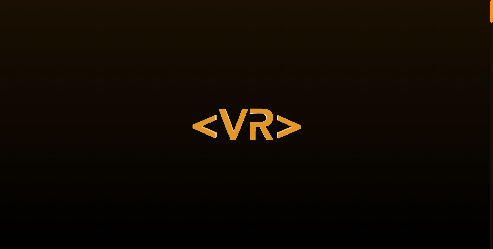

# **Portfolio Vinícius Roveri** ([Go To The Project](https://viniciusroveri.vercel.app/))

 

Project where I showcase all my abilities in Web Development, UX design, Motion Graphics and 3D Modelling, all merged together in one single piece. Made using various professional and industry standard tools for the front-end development such as GSAP for JavaScript animations, React Three Fiber which is an extension of the ThreeJS library, Bodymovin for making After Effects animations web-ready, and a whole more that when combined with the standard React, Typescript & Tailwind, create the art you see on the screen.

 

### **Index:**

- #### [Creative Process](#creative-process-1)

- #### [3D Models](#3d-models-1)
   - #### [Putting meshes into the code](#putting-meshes-into-the-code-1)
   - #### [Meshes' animations](#meshes-animations-1)
   - #### [Interactivity with the models](#interactivity-with-the-models-1)

- #### [GSAP Animations](#gsap-animations-1)

- #### [Intro Animation](#intro-animation-1)
   - #### [After Effects work](#after-effects-work-1)
   - #### [Bringing Motion Graphics to the code](#bringing-motion-graphics-to-the-code-1)

- #### [Performance Improvements](#performance-improvements-1)
   - #### [Intro animation not loading on start](#intro-animation-not-loading-on-start-1)
   - #### [3D meshes not appearing at the right time](#3d-meshes-not-appearing-at-the-right-time-1)
   - #### [Globe lagging when animating position and rotation](#globe-lagging-when-animating-position-and-rotation-1)
   - #### [Float animations' problems (or not)](#float-animations-problems-or-not-1)

- #### [Styling With Tailwind](#styling-with-tailwind-1)
   - #### [Is Tailwind the best option?](#is-tailwind-the-best-option-1)
   - #### [The architecture I used for styling](#the-architecture-i-used-for-styling-1)

 

## What challenges did I overcome working on this?

 

- ### **Creative Process**

The idea of bringing together all my skills in different areas of creativity and art is harder than it looks. The tools are not the main problem, I know I can learn how to use any library to make the idea in my mind come to life, so the hard part is exactly how do I get those ideas in my mind?
As creativity is basically using your experience on top of something that exists to create something new, I went searching for inspiration in other professional web developers' portfolios and used that to make something I thought would make sense to both showcase my personality and my technical skills.  
The two main inspirations were [**iuri.is**](https://iuri.is/) for the clean design and awesome display of information allied with the use of animations, and mainly [**itsSharlee**](https://itssharl.ee/) for the insane use of 3D, animation and design to reinforce his also awesome branding work, to create what is probably my favorite portfolio ever.  
With that references I went to work and united all my knowledge with a goal of displaying my work in a clean, interactive and concise way, to best show anyone who comes to my portfolio not only what Vinícius does, but also who Vinícius is.

 

- ### **3D Models**

A great part of my animation degree was in fact about 3D animation, so I already had the skills necessary to pull off the models I nedded without trouble. For that I used Blender, my favorite 3D software, and after all the modelling of the `<VR>`, the orange globe, the path and each icon, it was time to put it on the website.

   - ### Putting meshes into the code

      I used `React-Three-Fiber` and `React-Three-Drei` for that task, these are React extensions of the popular library `ThreeJS`, the industry standard for joining 3D modelling and web development. Back in Blender I exported each model as GLTF and put them in the `public` folder of the project, after that I used the `GLTFJSX` library to automatically create `JSX Functional Components` from each model.

   - ### Meshes' animations

      The first animation for them was in the intro, for that I used the `useEffect` hook to execute the code only on the component mounting, and GSAP to animate the position of each mesh as I wanted, using the `useRef` to reference to GSAP the component I wanted to animate. The second and last part was to give the `<VR>` model and each icon on the globe a "Keep Alive", a technique in animation to give more life to a prop/character. For that I used the `Float` component from `React-Three-Drei` that is the easiest and most perfomatic option for this task.  
      Lastly I had to decide when each animation would play. To do so I created two `consts` on the `globalConstants` file, one referring to the duration of each animation, and the other to the delay each animation have. This way I can just import each `const` wherever I need them to configure the animations, and most importantly of all, easily have a centralized control over all timings.

   - ### Interactivity with the models

      The main point of the globe is that it's interactive and the user must spin it to go to a certain part of the portfolio, I'll get into the performance bits later in this document, but the best solution for that was a combo between both the `React-Three` versions used, `fiber` and `drei`. To make the models react to scroll I used `Drei`'s `ScrollControls` component, after that I had two things to figure out: how to make the globe spin with the scroll and how to make it stay fixed at the bottom of the page. For both these tasks I went with the hooks `useScroll` and `useFrame`, which I could capture the current scroll offset and automatically animate the mesh accordingly with, respectively.  
      For both of these problems I had to develop an algorithm that calculates what the position/rotation of the globe should be at any given scroll offset, based on its starting and ending values, and the total size of the scroll. After that I simply put this algorithm into the `useFrame` so it's always being executed and the functionalities were working perfectly.

 

- ### **GSAP Animations**

As the meshes' animations were already explained earlier in the [Meshes' animations](#meshes-animations-1) section, let's talk about the textbox animations with GSAP. First of all it's important to know that the textbox animations are triggered with an `useEffect` with the dependency of the global state `activeSection` created as an `atom` from the `Recoil` library, and updated from the `SphereAndPath` component everytime the scroll values enters a range of certain content area (these value ranges are all predetermined in the `globalConstants` file). Other important fact is that the textbox content and background are two different `sections`, because this way both the styling and animations were made easier. That being said, the two main animations are the closing/opening when the content of the box changes, and the appearing/disappearing when the user scrolls into or away from the globe respectively.  
The first one is made animating out the text, making the width of the background 0%, and then reversing those stages so the background grows to its size again, and then the text is animated in.  
The second one is an easy animation but with one detail that makes it harder: The animation is the same as the first one, but with the movement of up or down, depending if it's appearing or disappearing. To determine which animation should play I check either the new current area is within the range of the globe, and if it isn't I add the movement down at the end of the animation to hide it. But if it is within that range I don't have to worry at all, as in the standard animation the box position is configured to go to its default, it'll be animated correctly automatically.

 

- ### **Intro Animation**

This one have a special place in my heart, as before getting into Web Development my main passion was Motion Graphics, and what really got me into deeply learning programming was when I once discovered my Motion Graphics animations not only could be made with code inside After Effects, but also could be transformed in `JSON` files to be used in actual programming projects, using `Bodymovin`, the tool I actually used in this part of the project.

   - ### After Effects work

      Back in After Effects I had to have an idea of what exactly to do in this intro animation. The first point is that it had to contain my brand, so I started looking at what I could do with the `<VR>` and realized that as it's supposed to resemble a code, it was a good idea to go with a typing animation on it. After that I added the animation to reveal my full name and thought about a simple way to make it disappear. This last step was added so in case the globe appearing animation was out of sync due to performance issues, my name would get out of the screen a nice way (I'll get more into this topics as we go). After the animation was done I used the `Bodymovin` extension to export it as a `JSON` file.

   - ### Bringing Motion Graphics to the code

      To use the `JSON` animation data on the website I used the `Lottie-Web` library with the standard configuration given in their documentation. After the animation is complete its `svg` is destroyed using the `.destroy()` method from the `Lottie-Web`, and I give its container `section` tag a `display: none` so it get out of the way of the incoming canvas with the 3D meshes.

 

- ### **Performance Improvements**

As the project uses very heavy assets like all 3D models and animations, the performance issues were being a huge deal before all optimizations. Each one demanded its own solution and I'm gonna explain them here:

   - ### Intro animation not loading on start

      This was a deal I had to break into to parts: Making the animation less heavy, and giving time for the browser to load it on start. The first part was back in After Effects, I did a lot of obvious optimizations (that for some reason I haven't done before) like removing some elements, hiding layers when they had no more content, using simpler shapes and avoid using unnecessary masks and scripts. And the second part I solved by manually creating a loading screen when the site is initialized, and giving it a predetermined delay before creating the svg of the animation. This delay is set manually, the other option was actually waiting for the animation to load before playing somehow, but as it's not that heavy of a process I decided to go with the first and easier solution.

   - ### 3D meshes not appearing at the right time

      If the canvas with the meshes was created right at the time when their animations should be played, the lack of loading time would create several inconsistencies among different hardware, not only that, as all animations are synchronized this would make the timing of every one of them be essentially random. To solve that I make the canvas appear some seconds before the animation of the meshes start, like that most browsers will have the necessary time to load the assets and execute everything as it was intended to.

   - ### Globe lagging when animating position and rotation

      This was happening because I was testing ways of animating its position/rotation values with `useFrame` according to the algorithm mentioned on the [Interactivity with the models](#interactivity-with-the-models-1) section, and when I tried to animate these values with the `useState` hook, it all became borderline unusable. So after looking up on the `React-Three` documentation I found out that the problem was that `useState` works asynchronously, and as `useFrame` executes all the time, it was like I was making infinite requests for the position to change, and of course this takes much more effort than just changing the position right away. So the solution, as said in the documentation, was to animate the actual position and rotation props of the mesh, using `useRef` and GSAP. This turned out to be the biggest performance problem of all, so once I solved it, it really was the last big effort before the website got pretty much ready to go to production.

   - ### Float animations' problems (or not)

      After all that optimizations I know that some of the remaining performance issues come from the `Float` animations, but I configured it as much as I could without making the animation get boring or stop. As the next step would probably be to remove it completely, I decided to keep it like that because as an artist I see that in this case it's a fair trade-off a bit less performance for me being able to complete the piece just as I want.

 

- ### **Styling With Tailwind**

The decision of styling with Tailwind comes from my curiosity after discovering and learning this tool, to see to what extent it could help in a big project, if it was faster to style with it and if it was really worth it using it instead of the `SCSS`. 

   - ### Is Tailwind the best option?

      The first impact was that I had to write so much less, so I instantly loved it, and seeing how the time and effort I saved was scaling throughout the project it really convinced me that this was the right tool for the task, and it got its spot as what I plan on using on my upcoming projects.

   - ### The architecture I used for styling

      The main downside to Tailwind is that if you use it the normal way you get almost unreadable `class` names, and that lack of clean code was really bothering my inner Uncle Bob. So to fix that I extract the classes into a `const`, which is a `string`, at the top of the file, and write everything that I want for each `class` there. This way not only the reading and writing gets easier, but I also exercise the actually very helpful `CSS-in-JS` concept, all in a very easy and elegant fashion.

 

## **Thank you for reading! It really means a lot to me knowing that people did enjoy this project!**

## **If you want to connect with me, feel free to go to [my LinkedIn](https://www.linkedin.com/in/vinicius-roveri/?locale=en_US), and lastly, don't forget to give a star to this repository!**

## **That's it, see y'all!**
